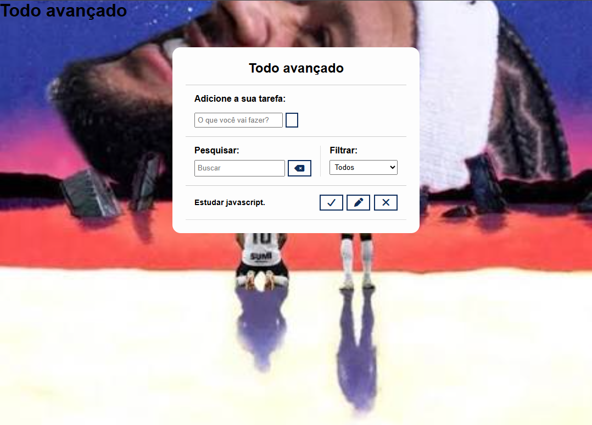

# 📝 To-Do List Avançado

<p align="center">
  <strong>Aplicação de gerenciamento de tarefas desenvolvida com HTML5, CSS3 e JavaScript.</strong>
</p>

<p align="center">
  <a href="https://github.com/KaweM/to-do-list-avancado">💻 Repositório</a>
</p>

---

## 📸 Preview

<p align="center">
  
</p>

---

## 📋 Sobre o projeto

O **To-Do List Avançado** é uma aplicação Front-end desenvolvida para praticar conceitos de **JavaScript**, manipulação do DOM e gerenciamento de dados no navegador.

A aplicação permite criar e gerenciar tarefas, oferecendo recursos de edição, conclusão, exclusão, pesquisa e filtragem.

---

## ✨ Funcionalidades

* ➕ Criação de tarefas
* ✏️ Edição de tarefas
* ✅ Conclusão de tarefas
* 🗑️ Exclusão de tarefas
* 🔎 Pesquisa de tarefas
* 🔽 Filtro por status
* 💾 Persistência das tarefas com `localStorage`
* 📱 Interface responsiva

---

## 🛠️ Tecnologias


* **HTML5** — estrutura da aplicação
* **CSS3** — estilização e responsividade
* **JavaScript** — lógica, interações e gerenciamento das tarefas
* **LocalStorage** — persistência dos dados
* **Font Awesome** — ícones da interface

---

## 🧠 Conceitos praticados

Durante o desenvolvimento foram praticados conceitos importantes de JavaScript:

* Manipulação do DOM;
* Eventos;
* Criação dinâmica de elementos;
* Arrays e objetos;
* JSON;
* CRUD no estado da aplicação;
* Pesquisa e filtros;
* Manipulação de classes CSS;
* Persistência de dados com `localStorage`.

---

## 💾 Persistência de dados

As tarefas são armazenadas no **LocalStorage** do navegador.

Dessa forma, os dados permanecem disponíveis mesmo depois que a página é recarregada.

```text
Nova tarefa
     ↓
JavaScript
     ↓
Atualização da interface
     ↓
LocalStorage
```

---

## 📂 Estrutura do projeto

```text
to-do-list-avancado/
│
├── css/
│   └── styles.css
│
├── img/
│
├── js/
│   └── scripts.js
│
├── index.html
└── README.md
```

---

## 🚀 Como executar

Clone o repositório:

```bash
git clone https://github.com/KaweM/to-do-list-avancado.git
```

Acesse a pasta:

```bash
cd to-do-list-avancado
```

Depois, abra o `index.html` no navegador.

Durante o desenvolvimento, também é possível utilizar o **Live Server** no Visual Studio Code.

---

## 🔮 Melhorias futuras

* [ ] Adicionar categorias às tarefas
* [ ] Adicionar prioridades
* [ ] Adicionar datas de vencimento
* [ ] Melhorar acessibilidade
* [ ] Adicionar modo escuro
* [ ] Evoluir a persistência para uma API e banco de dados

---

## 📌 Status

🟢 **Projeto funcional**

Projeto desenvolvido como prática de desenvolvimento Front-end e JavaScript.

---

## 👨‍💻 Desenvolvedor

### Kauê Miguel

Estudante de **Análise e Desenvolvimento de Sistemas**, com foco em desenvolvimento Front-end e evolução contínua em tecnologias web.

<p align="center">
  <a href="https://github.com/KaweM">
    
  </a>
</p>

---

<p align="center">
  <strong>Desenvolvido com HTML, CSS e JavaScript 💻</strong>
</p>

